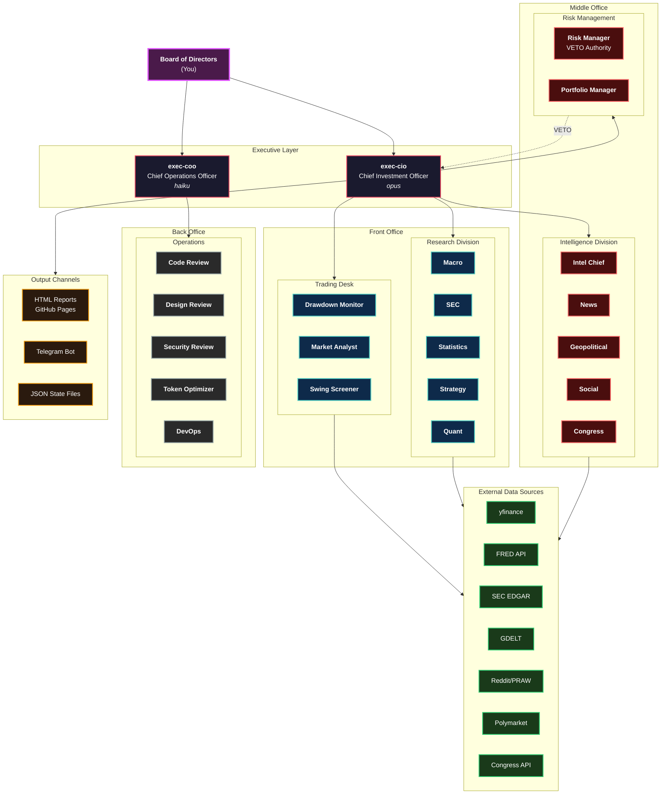
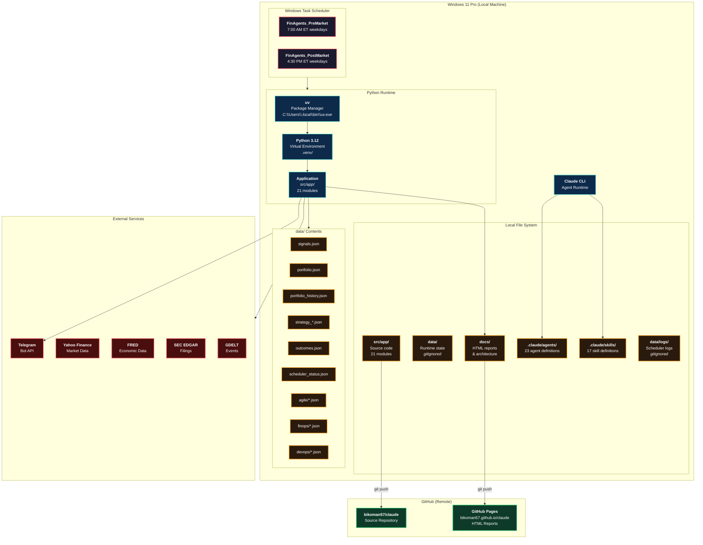
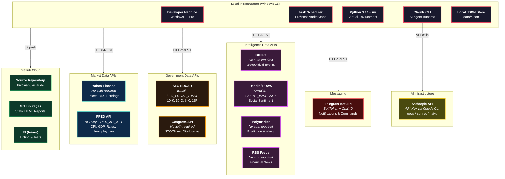
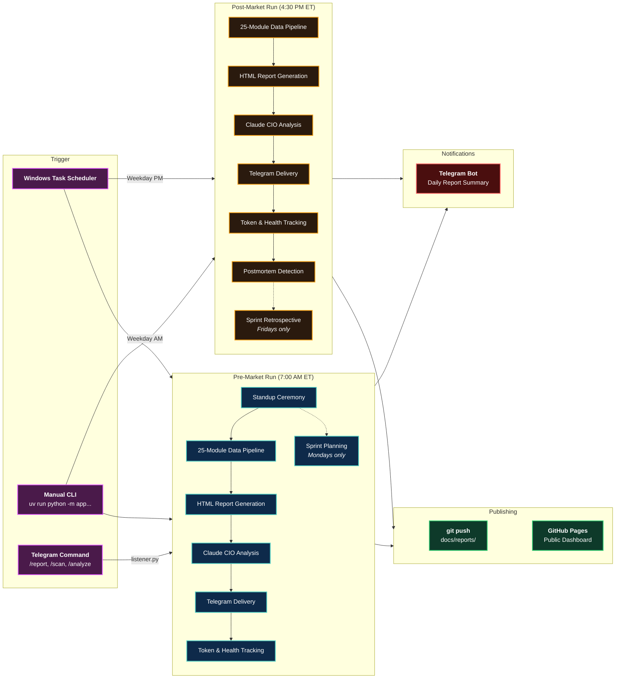
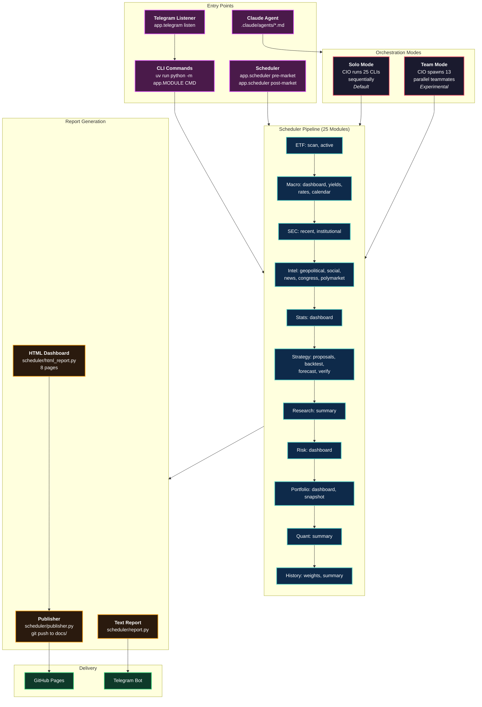

# Core Architecture Diagrams

---

## 1. System Architecture (High-Level Overview)

The entire system from user to outputs, showing all departments and their relationship to external services.

---

## 2. Logical Architecture

The five logical processing layers that data passes through, from raw ingestion to actionable output.

---

## 3. Physical Architecture

The physical runtime environment showing where components execute and where data resides.

---

## 4. Infrastructure / Cloud Architecture

Local infrastructure and all external service dependencies with authentication methods.

---

## 5. Deployment Architecture

How the system is deployed, scheduled, and delivers outputs to end users.

---

## 6. Application Architecture

Application entry points, orchestration modes, and how the scheduler drives module execution.

