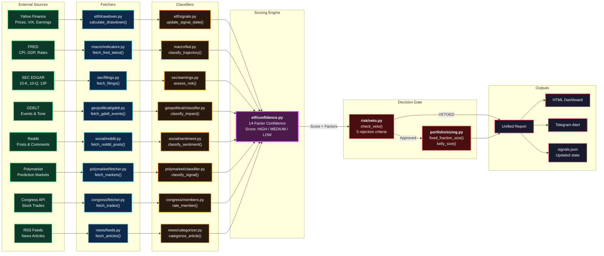
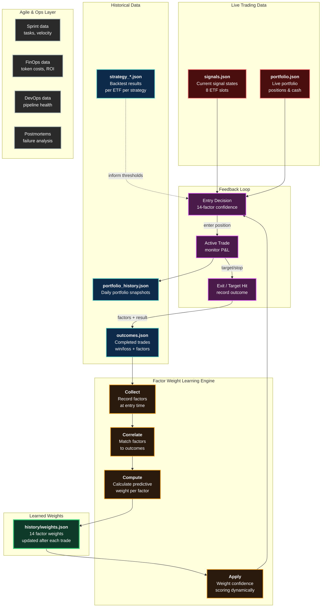
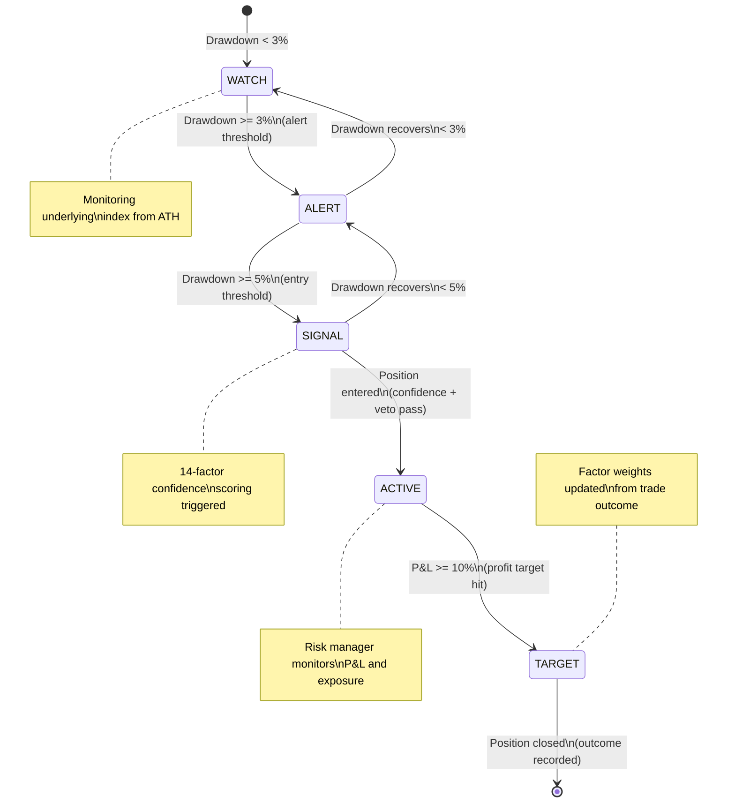
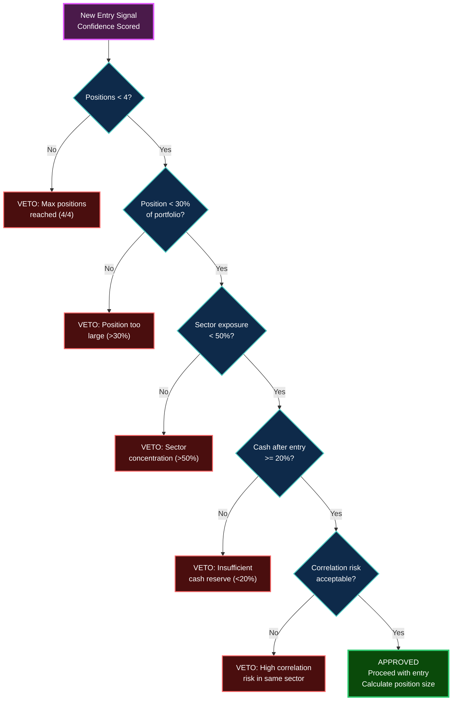

# Data Architecture Diagrams

---

## 1. Data Architecture Diagram

All persistent data stores, their schemas, and which modules own them.

```mermaid
graph TB
    subgraph SignalData["Signal & Trading Data"]
        SIG["<b>signals.json</b><br/>Signal[]<br/>- leveraged_ticker<br/>- underlying_ticker<br/>- state: SignalState<br/>- drawdown_pct<br/>- entry_price<br/>- current_pl_pct"]
        OUT["<b>outcomes.json</b><br/>TradeOutcome[]<br/>- ticker, entry/exit_date<br/>- entry/exit_price<br/>- pl_pct, factors_at_entry<br/>- win: bool"]
    end

    subgraph PortfolioData["Portfolio Data"]
        PORTF["<b>portfolio.json</b><br/>PortfolioConfig<br/>- total_value<br/>- cash_balance<br/>- positions[]<br/>- realized_pl"]
        PHIST["<b>portfolio_history.json</b><br/>PortfolioSnapshot[]<br/>- date, total_value<br/>- unrealized_pl<br/>- position_count"]
    end

    subgraph StrategyData["Strategy Data"]
        STRAT["<b>strategy_*.json</b><br/>BacktestResult[]<br/>- config, trades<br/>- win_rate, sharpe<br/>- max_drawdown"]
        FORECAST["<b>forecasts.json</b><br/>PriceTarget[]<br/>- ticker, target_price<br/>- probability, timeframe"]
    end

    subgraph HistoryData["History & Learning Data"]
        HWEIGHTS["<b>history/weights.json</b><br/>FactorWeight[]<br/>- factor_name<br/>- predictive_weight<br/>- sample_count"]
        HOUTCOMES["<b>history/outcomes/</b><br/>Monthly archives<br/>of trade outcomes"]
    end

    subgraph AgileData["Agile & Ops Data"]
        SPRINT["<b>agile/sprints.json</b><br/>Sprint[]<br/>- number, goals<br/>- tasks[], status"]
        STANDUP["<b>agile/standups/</b><br/>StandupEntry[]<br/>- department, agent<br/>- yesterday, today, blockers"]
        RETRO["<b>agile/retros/</b><br/>RetroEntry[]<br/>- went_well, improve<br/>- action_items"]
        ROAD["<b>agile/roadmap.json</b><br/>OKR[]<br/>- objective, key_results"]
    end

    subgraph OpsData["Operational Data"]
        FINOPS["<b>finops/*.json</b><br/>TokenUsageRecord[]<br/>- agent, model, tokens<br/>- cost_usd, department"]
        DEVOPS_D["<b>devops/*.json</b><br/>ModuleHealth[]<br/>- module, success_rate_7d<br/>- grade: A-F"]
        POSTM["<b>postmortems/*.json</b><br/>Postmortem<br/>- trade, root_cause<br/>- lessons_learned"]
        SCHED_S["<b>scheduler_status.json</b><br/>- last_run_type<br/>- last_run_time<br/>- module_results[]"]
    end

    subgraph Modules["Writing Modules"]
        M_ETF["etf/store.py"]
        M_PORT["portfolio/tracker.py"]
        M_STRAT["strategy/store.py"]
        M_HIST["history/store.py"]
        M_AGILE["agile/store.py"]
        M_FINOPS["finops/tracker.py"]
        M_DEVOPS["devops/health.py"]
        M_SCHED["scheduler/runner.py"]
    end

    M_ETF -->|read/write| SIG
    M_ETF -->|write| OUT
    M_PORT -->|read/write| PORTF
    M_PORT -->|append| PHIST
    M_STRAT -->|write| STRAT
    M_STRAT -->|write| FORECAST
    M_HIST -->|read/write| HWEIGHTS
    M_HIST -->|archive| HOUTCOMES
    M_AGILE -->|read/write| SPRINT
    M_AGILE -->|write| STANDUP
    M_AGILE -->|write| RETRO
    M_AGILE -->|read/write| ROAD
    M_FINOPS -->|append| FINOPS
    M_DEVOPS -->|write| DEVOPS_D
    M_DEVOPS -->|write| POSTM
    M_SCHED -->|write| SCHED_S

    classDef signal fill:#4a0e0e,color:#fff,stroke:#ff6b6b,stroke-width:2px
    classDef portfolio fill:#0e2a4a,color:#fff,stroke:#4ecdc4,stroke-width:2px
    classDef strategy fill:#2a1a0e,color:#fff,stroke:#f39c12,stroke-width:2px
    classDef history fill:#0e3a2a,color:#fff,stroke:#2ecc71,stroke-width:2px
    classDef agile fill:#4a1a4a,color:#fff,stroke:#e056fd,stroke-width:2px
    classDef ops fill:#2a2a2a,color:#fff,stroke:#95a5a6,stroke-width:2px
    classDef mod fill:#1a1a2e,color:#fff,stroke:#e94560,stroke-width:2px

    class SIG,OUT signal
    class PORTF,PHIST portfolio
    class STRAT,FORECAST strategy
    class HWEIGHTS,HOUTCOMES history
    class SPRINT,STANDUP,RETRO,ROAD agile
    class FINOPS,DEVOPS_D,POSTM,SCHED_S ops
    class M_ETF,M_PORT,M_STRAT,M_HIST,M_AGILE,M_FINOPS,M_DEVOPS,M_SCHED mod
```

---

## 2. Data Flow Diagram (DFD)

Complete data flow from 8 external sources through processing to final outputs.

---

## 3. ETL / Pipeline Architecture

The 25-module scheduler pipeline showing Extract, Transform, and Load stages.

```mermaid
graph TB
    subgraph Extract["EXTRACT (External API Calls)"]
        E1["1. etf scan<br/>yfinance prices"]
        E2["2. etf active<br/>active positions"]
        E3["3. macro dashboard<br/>FRED: VIX, CPI"]
        E4["4. macro yields<br/>Treasury curve"]
        E5["5. macro rates<br/>Fed funds"]
        E6["6. macro calendar<br/>Economic events"]
        E7["7. sec recent<br/>EDGAR filings"]
        E8["8. sec institutional<br/>13F holdings"]
        E9["9. geopolitical summary<br/>GDELT events"]
        E10["10. social summary<br/>Reddit + officials"]
        E11["11. news summary<br/>RSS articles"]
        E12["12. congress summary<br/>STOCK Act trades"]
        E13["13. polymarket summary<br/>Prediction markets"]
    end

    subgraph Transform["TRANSFORM (Analysis & Scoring)"]
        T1["14. statistics dashboard<br/>Breadth, correlations"]
        T2["15. strategy proposals<br/>Entry thresholds"]
        T3["16. strategy backtest-all<br/>Historical validation"]
        T4["17. strategy forecast<br/>Price targets"]
        T5["18. strategy verify<br/>Result validation"]
        T6["19. research summary<br/>Research findings"]
        T7["20. risk dashboard<br/>Exposure + veto"]
        T8["21. portfolio dashboard<br/>Position summary"]
    end

    subgraph Load["LOAD (Persist & Compute)"]
        L1["22. portfolio snapshot<br/>Save daily snapshot"]
        L2["23. quant summary<br/>Regime detection"]
        L3["24. history weights<br/>Factor learning"]
        L4["25. history summary<br/>Trade outcomes"]
    end

    subgraph Output["OUTPUT"]
        HTML_OUT["HTML Report<br/>8-page dashboard"]
        TG_OUT["Telegram<br/>Daily summary"]
        JSON_OUT["JSON State<br/>Updated files"]
    end

    Extract --> Transform --> Load --> Output

    classDef extract fill:#0e3a2a,color:#fff,stroke:#2ecc71,stroke-width:2px
    classDef transform fill:#2a1a0e,color:#fff,stroke:#f39c12,stroke-width:2px
    classDef load fill:#0e2a4a,color:#fff,stroke:#4ecdc4,stroke-width:2px
    classDef output fill:#4a0e0e,color:#fff,stroke:#ff6b6b,stroke-width:2px

    class E1,E2,E3,E4,E5,E6,E7,E8,E9,E10,E11,E12,E13 extract
    class T1,T2,T3,T4,T5,T6,T7,T8 transform
    class L1,L2,L3,L4 load
    class HTML_OUT,TG_OUT,JSON_OUT output
```

---

## 4. Data Platform Architecture

The JSON-based storage layer, learning system, and how historical data drives future decisions.

---

## 5. Information Architecture

The signal state machine, 14-factor confidence model, and risk veto decision tree.

### 14-Factor Confidence Scoring Model

```mermaid
graph TB
    subgraph Factors["14 Confidence Factors"]
        subgraph Quantitative["Quantitative Factors"]
            F1["1. Drawdown Depth<br/>FAVORABLE if > 1.5x threshold"]
            F2["2. VIX Regime<br/>FAVORABLE if ELEVATED/EXTREME"]
            F3["3. Fed Regime<br/>FAVORABLE if CUTTING"]
            F4["4. Yield Curve<br/>FAVORABLE if NORMAL"]
        end

        subgraph Fundamental["Fundamental Factors"]
            F5["5. SEC Sentiment<br/>FAVORABLE if no material filings"]
            F6["6. Fundamentals Health<br/>FAVORABLE if STRONG"]
            F7["7. Prediction Markets<br/>FAVORABLE if support entry"]
            F8["8. Earnings Risk<br/>FAVORABLE if no imminent earnings"]
        end

        subgraph Sentiment["Sentiment Factors (Contrarian)"]
            F9["9. Geopolitical Risk<br/>FAVORABLE if LOW"]
            F10["10. Social Sentiment<br/>FAVORABLE if BEARISH"]
            F11["11. News Sentiment<br/>FAVORABLE if BEARISH"]
            F12["12. Market Statistics<br/>FAVORABLE if RISK_OFF"]
        end

        subgraph Other["Alignment & Risk"]
            F13["13. Congress Sentiment<br/>FAVORABLE if BULLISH<br/><i>NOT contrarian</i>"]
            F14["14. Portfolio Risk<br/>FAVORABLE if within limits<br/><i>Can trigger VETO</i>"]
        end
    end

    subgraph Scoring["Confidence Score"]
        HIGH["<b>HIGH</b><br/>10+ of 14 favorable"]
        MEDIUM["<b>MEDIUM</b><br/>5-9 of 14 favorable"]
        LOW["<b>LOW</b><br/>0-4 of 14 favorable"]
    end

    F1 & F2 & F3 & F4 --> Scoring
    F5 & F6 & F7 & F8 --> Scoring
    F9 & F10 & F11 & F12 --> Scoring
    F13 & F14 --> Scoring

    classDef quant fill:#0e2a4a,color:#fff,stroke:#4ecdc4,stroke-width:2px
    classDef fund fill:#2a1a0e,color:#fff,stroke:#f39c12,stroke-width:2px
    classDef sent fill:#0e3a2a,color:#fff,stroke:#2ecc71,stroke-width:2px
    classDef other fill:#4a1a4a,color:#fff,stroke:#e056fd,stroke-width:2px
    classDef high fill:#0a4a0a,color:#fff,stroke:#2ecc71,stroke-width:3px
    classDef med fill:#4a4a0a,color:#fff,stroke:#f1c40f,stroke-width:3px
    classDef low fill:#4a0e0e,color:#fff,stroke:#ff6b6b,stroke-width:3px

    class F1,F2,F3,F4 quant
    class F5,F6,F7,F8 fund
    class F9,F10,F11,F12 sent
    class F13,F14 other
    class HIGH high
    class MEDIUM med
    class LOW low
```

### Risk Veto Decision Tree

