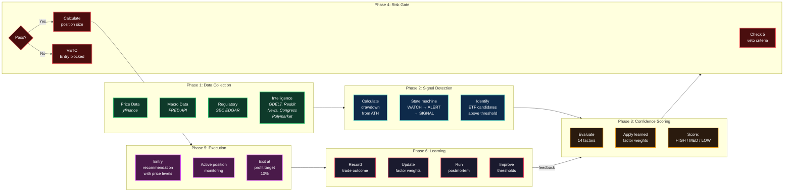
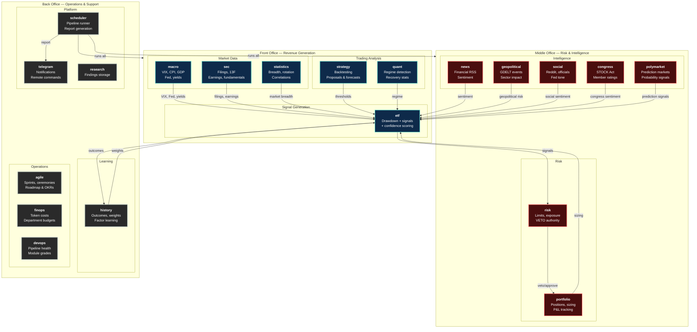

# Enterprise & Business Architecture Diagrams

---

## 1. Enterprise Architecture (Zachman-Inspired)

Full enterprise view across four architectural domains: Business, Application, Data, and Technology.

```mermaid
graph TB
    subgraph Business["Business Architecture"]
        direction LR
        BS["<b>Strategy</b><br/>Leveraged ETF<br/>mean-reversion<br/>swing trading"]
        BP["<b>Process</b><br/>Monitor drawdowns<br/>Score confidence<br/>Check risk → Enter<br/>Track P&L → Exit"]
        BO["<b>Organization</b><br/>Board → Executive<br/>→ Front Office<br/>→ Middle Office<br/>→ Back Office"]
        BM["<b>Metrics</b><br/>Win rate, Sharpe<br/>Factor weights<br/>Token ROI"]
    end

    subgraph Application["Application Architecture"]
        direction LR
        AT["<b>Trading Apps</b><br/>etf, risk, portfolio<br/>strategy, quant"]
        AI_APP["<b>Intelligence Apps</b><br/>news, geopolitical<br/>social, congress<br/>polymarket"]
        AM["<b>Market Data Apps</b><br/>macro, sec<br/>statistics"]
        AP["<b>Platform Apps</b><br/>scheduler, telegram<br/>agile, finops, devops"]
    end

    subgraph Data["Data Architecture"]
        direction LR
        DL["<b>Live State</b><br/>signals.json<br/>portfolio.json"]
        DH["<b>Historical</b><br/>outcomes.json<br/>portfolio_history.json<br/>strategy_*.json"]
        DW["<b>Learned Weights</b><br/>history/weights.json<br/>Factor predictive power"]
        DO["<b>Operational</b><br/>agile/, finops/<br/>devops/, postmortems/"]
    end

    subgraph Technology["Technology Architecture"]
        direction LR
        TW["<b>Runtime</b><br/>Windows 11<br/>Python 3.12<br/>uv package mgr"]
        TC["<b>AI Engine</b><br/>Claude CLI<br/>opus/sonnet/haiku<br/>23 agents"]
        TE["<b>External</b><br/>8 data APIs<br/>Telegram Bot API<br/>GitHub Pages"]
        TI["<b>Infrastructure</b><br/>Task Scheduler<br/>Local JSON store<br/>Git version control"]
    end

    Business --> Application --> Data --> Technology

    classDef biz fill:#4a1a4a,color:#fff,stroke:#e056fd,stroke-width:2px
    classDef app fill:#0e2a4a,color:#fff,stroke:#4ecdc4,stroke-width:2px
    classDef data fill:#2a1a0e,color:#fff,stroke:#f39c12,stroke-width:2px
    classDef tech fill:#0e3a2a,color:#fff,stroke:#2ecc71,stroke-width:2px

    class BS,BP,BO,BM biz
    class AT,AI_APP,AM,AP app
    class DL,DH,DW,DO data
    class TW,TC,TE,TI tech
```

---

## 2. Business Capability Map

What the business can do — organized by strategic, core, and supporting capabilities.

```mermaid
graph TB
    subgraph Strategic["Strategic Capabilities"]
        direction LR
        SC1["<b>Market Intelligence</b><br/>Multi-source sentiment<br/>Geopolitical monitoring<br/>Congressional trading<br/>Prediction markets"]
        SC2["<b>Quantitative Research</b><br/>Regime detection<br/>Factor analysis<br/>Strategy backtesting<br/>Recovery statistics"]
        SC3["<b>AI Orchestration</b><br/>23-agent system<br/>CIO synthesis<br/>Solo & team modes<br/>Cross-domain reasoning"]
    end

    subgraph Core["Core Capabilities"]
        direction LR
        CC1["<b>Signal Generation</b><br/>Drawdown monitoring<br/>State machine lifecycle<br/>8 leveraged ETFs<br/>Alert thresholds"]
        CC2["<b>Confidence Scoring</b><br/>14-factor model<br/>Learned factor weights<br/>HIGH/MEDIUM/LOW<br/>Contrarian logic"]
        CC3["<b>Risk Management</b><br/>5-criterion veto gate<br/>Exposure calculation<br/>Position limits<br/>Sector concentration"]
        CC4["<b>Portfolio Management</b><br/>Position tracking<br/>Kelly & fixed-fraction sizing<br/>P&L monitoring<br/>Daily snapshots"]
    end

    subgraph Supporting["Supporting Capabilities"]
        direction LR
        SP1["<b>Reporting</b><br/>8-page HTML dashboard<br/>Telegram notifications<br/>GitHub Pages publishing"]
        SP2["<b>Operations</b><br/>Code/security review<br/>Token cost tracking<br/>Pipeline health<br/>DevOps monitoring"]
        SP3["<b>Agile Management</b><br/>Sprint planning<br/>Daily standups<br/>Retrospectives<br/>OKR tracking"]
        SP4["<b>Learning System</b><br/>Trade outcome recording<br/>Factor weight computation<br/>Postmortem analysis<br/>Strategy improvement"]
    end

    Strategic --> Core --> Supporting

    classDef strategic fill:#4a1a4a,color:#fff,stroke:#e056fd,stroke-width:2px
    classDef core fill:#4a0e0e,color:#fff,stroke:#ff6b6b,stroke-width:2px
    classDef support fill:#0e2a4a,color:#fff,stroke:#4ecdc4,stroke-width:2px

    class SC1,SC2,SC3 strategic
    class CC1,CC2,CC3,CC4 core
    class SP1,SP2,SP3,SP4 support
```

---

## 3. Solution Architecture

End-to-end solution flow: from raw market data to actionable trading decisions and continuous learning.

---

## 4. Application Landscape

All 21 modules positioned by business domain (front/middle/back office) with key interactions.

