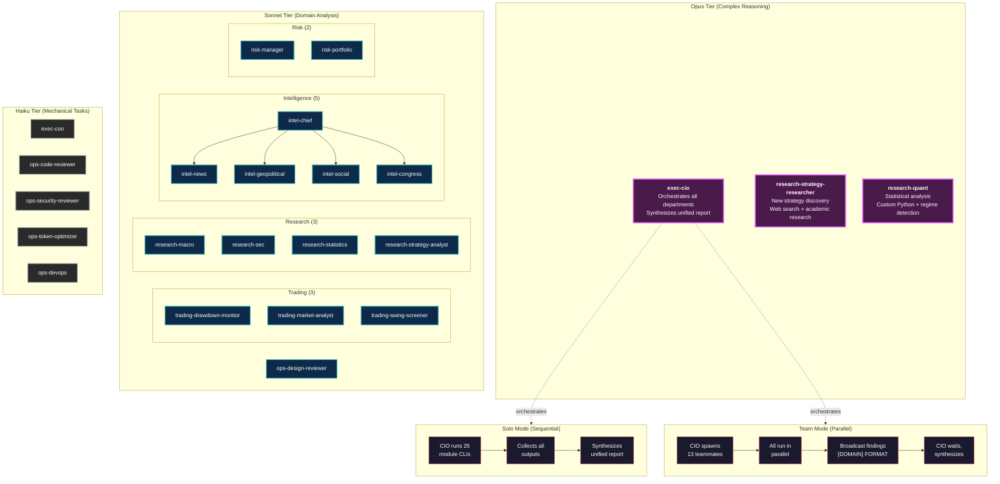
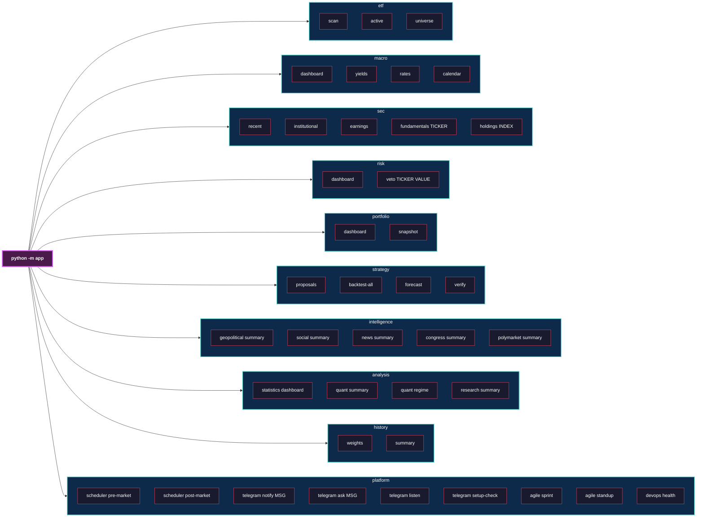
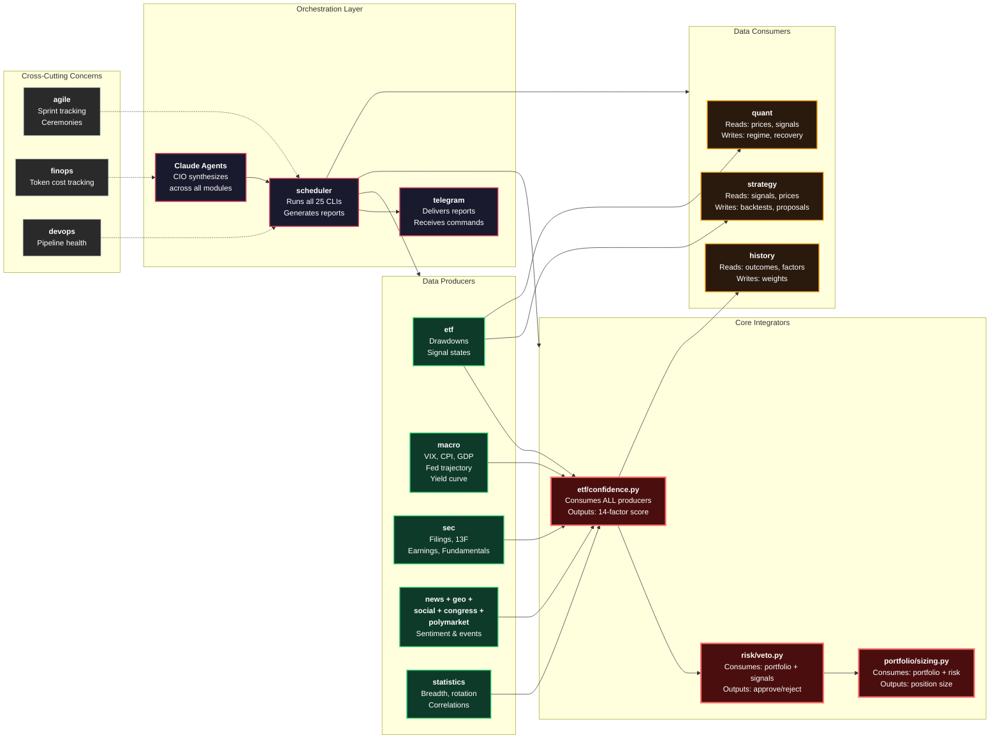

# Software Design & Engineering Diagrams

---

## 1. Component Architecture

All 21 Python modules as components with their key types, responsibilities, and dependencies.

```mermaid
graph TB
    subgraph CoreTrading["Core Trading Components"]
        ETF["<b>etf/</b><br/>SignalState, Signal<br/>ConfidenceScore<br/>DrawdownResult<br/>ETFMapping, Universe"]
        RISK["<b>risk/</b><br/>RiskLimits, VetoResult<br/>ExposureReport<br/>Position"]
        PORT["<b>portfolio/</b><br/>PortfolioConfig<br/>PortfolioPosition<br/>PortfolioSnapshot<br/>PositionSize"]
    end

    subgraph MarketData["Market Data Components"]
        MACRO["<b>macro/</b><br/>MacroIndicators<br/>FedTrajectory<br/>YieldCurveState<br/>EconomicEvent"]
        SEC["<b>sec/</b><br/>SECFiling, Filing13F<br/>EarningsEvent<br/>FundamentalData<br/>IndexHolding"]
        STATS["<b>statistics/</b><br/>BreadthIndicator<br/>SectorRotation<br/>CorrelationMatrix"]
    end

    subgraph Intelligence["Intelligence Components"]
        NEWS["<b>news/</b><br/>NewsArticle<br/>SentimentScore<br/>JournalistProfile"]
        GEO["<b>geopolitical/</b><br/>GDELTEvent<br/>ImpactClassification<br/>EventCategory"]
        SOCIAL["<b>social/</b><br/>RedditPost<br/>FedStatement<br/>SentimentResult"]
        CONG["<b>congress/</b><br/>CongressTrade<br/>MemberProfile<br/>SectorAggregation"]
        POLY["<b>polymarket/</b><br/>PolymarketMarket<br/>MarketCategory<br/>MarketSignal"]
    end

    subgraph StrategyEngine["Strategy Engine"]
        STRAT["<b>strategy/</b><br/>BacktestConfig<br/>BacktestResult<br/>StrategyProposal<br/>PriceTarget"]
        QUANT["<b>quant/</b><br/>MarketRegime<br/>RecoveryStats<br/>SignificanceTest"]
        HIST["<b>history/</b><br/>TradeOutcome<br/>FactorWeight<br/>OutcomeRecorder"]
        RESEARCH["<b>research/</b><br/>ResearchFinding<br/>ResearchStore"]
    end

    subgraph Platform["Platform Components"]
        SCHED["<b>scheduler/</b><br/>SchedulerRun<br/>ModuleResult<br/>HTMLReport<br/>Publisher"]
        TG["<b>telegram/</b><br/>TelegramClient<br/>TelegramConfig<br/>Dispatcher<br/>Listener"]
        AGILE["<b>agile/</b><br/>Sprint, SprintTask<br/>StandupEntry<br/>RetroEntry, OKR"]
        FINOPS["<b>finops/</b><br/>TokenUsageRecord<br/>DepartmentBudget<br/>ROIAnalysis"]
        DEVOPS["<b>devops/</b><br/>ModuleHealth<br/>SystemHealth<br/>PipelineGrade"]
    end

    %% Cross-component dependencies
    ETF -->|drawdowns| RISK
    ETF -->|signals| PORT
    ETF -->|14 factors| MACRO
    ETF -->|14 factors| SEC
    ETF -->|14 factors| NEWS
    ETF -->|14 factors| GEO
    ETF -->|14 factors| SOCIAL
    ETF -->|14 factors| CONG
    ETF -->|14 factors| POLY
    ETF -->|14 factors| STATS
    RISK -->|veto| ETF
    PORT -->|sizing| ETF
    STRAT -->|thresholds| ETF
    QUANT -->|regime| ETF
    HIST -->|weights| ETF
    SCHED -->|runs all| ETF
    SCHED -->|runs all| MACRO
    SCHED -->|runs all| SEC
    SCHED -->|report| TG

    classDef core fill:#4a0e0e,color:#fff,stroke:#ff6b6b,stroke-width:2px
    classDef market fill:#0e2a4a,color:#fff,stroke:#4ecdc4,stroke-width:2px
    classDef intel fill:#0e3a2a,color:#fff,stroke:#2ecc71,stroke-width:2px
    classDef strat fill:#2a1a0e,color:#fff,stroke:#f39c12,stroke-width:2px
    classDef platform fill:#1a1a2e,color:#fff,stroke:#e94560,stroke-width:2px

    class ETF,RISK,PORT core
    class MACRO,SEC,STATS market
    class NEWS,GEO,SOCIAL,CONG,POLY intel
    class STRAT,QUANT,HIST,RESEARCH strat
    class SCHED,TG,AGILE,FINOPS,DEVOPS platform
```

---

## 2. Service / Agent Architecture

23 AI agents organized by model tier and department, with Solo vs Team communication patterns.

---

## 3. API Architecture (CLI Command Tree)

All module CLI entry points accessible via `uv run python -m app.MODULE COMMAND`.

---

## 4. Integration Architecture

How modules connect to each other: data producers, consumers, and cross-cutting concerns.

---

## 5. Layered Architecture

Six horizontal layers from presentation down to external services, showing what belongs at each level.

```mermaid
graph TB
    subgraph L1["Presentation Layer"]
        HTML["<b>HTML Dashboard</b><br/>scheduler/html_report.py<br/>8-page dark fintech theme<br/>Chart.js visualizations"]
        TG_UI["<b>Telegram Interface</b><br/>telegram/formatting.py<br/>Markdown messages<br/>Command responses"]
        CLI_UI["<b>CLI Output</b><br/>Each module's __main__.py<br/>Structured text output"]
    end

    subgraph L2["Orchestration Layer"]
        SCHED_L["<b>Scheduler</b><br/>runner.py — 25-module pipeline<br/>scheduled_run.py — pre/post market<br/>publisher.py — git push to Pages"]
        AGENT_L["<b>Agent System</b><br/>23 agents in .claude/agents/<br/>Solo mode vs Team mode<br/>CIO orchestration"]
        TG_L["<b>Telegram Bot</b><br/>listener.py — long-polling<br/>dispatcher.py — command routing<br/>client.py — async HTTP"]
    end

    subgraph L3["Domain Layer"]
        subgraph Trading_L["Trading"]
            ETF_L["etf/signals<br/>etf/drawdown<br/>etf/confidence"]
        end
        subgraph Research_L["Research"]
            STRAT_L["strategy/*<br/>quant/*<br/>research/*"]
        end
        subgraph Intel_L["Intelligence"]
            INTEL_MODS["news/*<br/>geopolitical/*<br/>social/*<br/>congress/*<br/>polymarket/*"]
        end
        subgraph Market_L["Market Data"]
            MKT_MODS["macro/*<br/>sec/*<br/>statistics/*"]
        end
    end

    subgraph L4["Risk & Decision Layer"]
        RISK_L["<b>Risk Management</b><br/>risk/limits.py — RiskLimits<br/>risk/exposure.py — ExposureReport<br/>risk/veto.py — check_veto()"]
        PORT_L["<b>Portfolio Management</b><br/>portfolio/tracker.py — positions<br/>portfolio/sizing.py — Kelly & fixed-fraction"]
    end

    subgraph L5["Data Access Layer"]
        STORES["<b>JSON Stores</b><br/>etf/store.py — signals<br/>history/store.py — outcomes<br/>strategy/store.py — backtests<br/>agile/store.py — sprints<br/>congress/store.py — trades"]
        HISTORY_L["<b>Learning System</b><br/>history/weights.py — factor weights<br/>history/recorder.py — outcome recording"]
    end

    subgraph L6["External Services Layer"]
        EXT["<b>External APIs</b><br/>yfinance — prices, VIX<br/>FRED — macro indicators<br/>SEC EDGAR — filings<br/>GDELT — geopolitical events<br/>Reddit/PRAW — social sentiment<br/>Polymarket — prediction markets<br/>Congress API — STOCK Act<br/>Telegram Bot API — messaging"]
    end

    L1 --> L2 --> L3 --> L4 --> L5 --> L6

    classDef presentation fill:#4a1a4a,color:#fff,stroke:#e056fd,stroke-width:2px
    classDef orchestration fill:#1a1a2e,color:#fff,stroke:#e94560,stroke-width:2px
    classDef domain fill:#0e2a4a,color:#fff,stroke:#4ecdc4,stroke-width:2px
    classDef risk fill:#4a0e0e,color:#fff,stroke:#ff6b6b,stroke-width:2px
    classDef data fill:#2a1a0e,color:#fff,stroke:#f39c12,stroke-width:2px
    classDef external fill:#0e3a2a,color:#fff,stroke:#2ecc71,stroke-width:2px

    class HTML,TG_UI,CLI_UI presentation
    class SCHED_L,AGENT_L,TG_L orchestration
    class ETF_L,STRAT_L,INTEL_MODS,MKT_MODS domain
    class RISK_L,PORT_L risk
    class STORES,HISTORY_L data
    class EXT external
```

