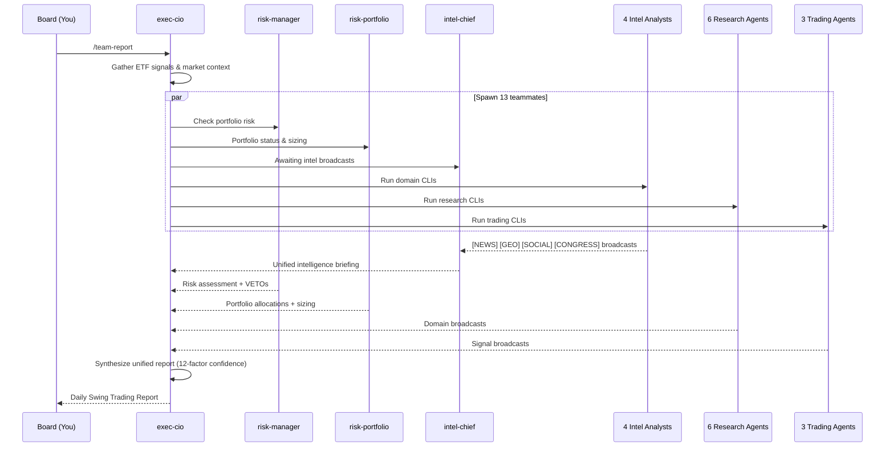

# Enterprise Trading Company — Organizational Chart

## Mermaid Org Chart

```mermaid
graph TB
    BOARD["<b>Board of Directors</b><br/>(You)"]

    subgraph Executive
        CIO["<b>exec-cio</b><br/>Chief Investment Officer<br/><i>opus</i>"]
        COO["<b>exec-coo</b><br/>Chief Operations Officer<br/><i>sonnet</i>"]
    end

    subgraph Risk Management
        RISK["<b>risk-manager</b><br/>Risk Limits & Veto<br/><i>sonnet</i>"]
        PORT["<b>risk-portfolio</b><br/>Portfolio & Sizing<br/><i>sonnet</i>"]
    end

    subgraph Trading Desk
        T_DD["<b>trading-drawdown-monitor</b><br/>Drawdown Tracking<br/><i>sonnet</i>"]
        T_MKT["<b>trading-market-analyst</b><br/>Momentum & Trend<br/><i>sonnet</i>"]
        T_SW["<b>trading-swing-screener</b><br/>Entry/Exit Signals<br/><i>sonnet</i>"]
    end

    subgraph Research
        R_MAC["<b>research-macro</b><br/>VIX, Fed, Yields<br/><i>sonnet</i>"]
        R_SEC["<b>research-sec</b><br/>SEC & Institutional<br/><i>sonnet</i>"]
        R_STAT["<b>research-statistics</b><br/>Breadth & Correlations<br/><i>sonnet</i>"]
        R_STRAT["<b>research-strategy-analyst</b><br/>Backtesting<br/><i>sonnet</i>"]
        R_RES["<b>research-strategy-researcher</b><br/>Strategy Discovery<br/><i>opus</i>"]
        R_QUANT["<b>research-quant</b><br/>Quantitative Analysis<br/><i>opus</i>"]
    end

    subgraph Intelligence
        I_CHIEF["<b>intel-chief</b><br/>Intelligence Director<br/><i>sonnet</i>"]
        I_NEWS["<b>intel-news</b><br/>News Sentiment<br/><i>sonnet</i>"]
        I_GEO["<b>intel-geopolitical</b><br/>Geopolitical Risk<br/><i>sonnet</i>"]
        I_SOC["<b>intel-social</b><br/>Social Sentiment<br/><i>sonnet</i>"]
        I_CONG["<b>intel-congress</b><br/>Congress Trades<br/><i>sonnet</i>"]
    end

    subgraph Operations
        O_CODE["<b>ops-code-reviewer</b><br/><i>sonnet</i>"]
        O_DESIGN["<b>ops-design-reviewer</b><br/><i>sonnet</i>"]
        O_SEC["<b>ops-security-reviewer</b><br/><i>sonnet</i>"]
        O_TOK["<b>ops-token-optimizer</b><br/><i>haiku</i>"]
        O_DEV["<b>ops-devops</b><br/>Pipeline Health<br/><i>haiku</i>"]
    end

    %% Board to Executive
    BOARD --> CIO
    BOARD --> COO

    %% CIO oversees front & middle office
    CIO --> RISK
    CIO --> PORT
    CIO --> T_DD
    CIO --> T_MKT
    CIO --> T_SW
    CIO --> R_MAC
    CIO --> R_SEC
    CIO --> R_STAT
    CIO --> R_STRAT
    CIO --> R_RES
    CIO --> R_QUANT
    CIO --> I_CHIEF

    %% Intel-chief aggregates intelligence analysts
    I_CHIEF --> I_NEWS
    I_CHIEF --> I_GEO
    I_CHIEF --> I_SOC
    I_CHIEF --> I_CONG

    %% COO oversees back office
    COO --> O_CODE
    COO --> O_DESIGN
    COO --> O_SEC
    COO --> O_TOK
    COO --> O_DEV

    %% Styling
    classDef board fill:#4a1a4a,color:#fff,stroke:#e056fd,stroke-width:3px
    classDef exec fill:#1a1a2e,color:#fff,stroke:#e94560,stroke-width:2px
    classDef risk fill:#4a0e0e,color:#fff,stroke:#ff6b6b,stroke-width:2px
    classDef trading fill:#0e2a4a,color:#fff,stroke:#4ecdc4,stroke-width:2px
    classDef research fill:#2a1a0e,color:#fff,stroke:#f39c12,stroke-width:2px
    classDef intel fill:#0e3a2a,color:#fff,stroke:#2ecc71,stroke-width:2px
    classDef ops fill:#2a2a2a,color:#fff,stroke:#95a5a6,stroke-width:2px

    class BOARD board
    class CIO,COO exec
    class RISK,PORT risk
    class T_DD,T_MKT,T_SW trading
    class R_MAC,R_SEC,R_STAT,R_STRAT,R_RES,R_QUANT research
    class I_CHIEF,I_NEWS,I_GEO,I_SOC,I_CONG intel
    class O_CODE,O_DESIGN,O_SEC,O_TOK,O_DEV ops
```

## Agent Roster

| # | Agent | Model | Department | Role |
|---|-------|-------|------------|------|
| 1 | `exec-cio` | opus | Executive | Chief Investment Officer — top orchestrator |
| 2 | `exec-coo` | sonnet | Executive | Chief Operations Officer — system health |
| 3 | `risk-manager` | sonnet | Risk Mgmt | Risk limits, exposure checks, VETO authority |
| 4 | `risk-portfolio` | sonnet | Risk Mgmt | Portfolio tracking, position sizing |
| 5 | `trading-drawdown-monitor` | sonnet | Trading | ETF drawdown monitoring |
| 6 | `trading-market-analyst` | sonnet | Trading | Market momentum & trend context |
| 7 | `trading-swing-screener` | sonnet | Trading | Entry/exit signal screening |
| 8 | `research-macro` | sonnet | Research | VIX, Fed policy, yields, economic indicators |
| 9 | `research-sec` | sonnet | Research | SEC filings, institutional 13F activity |
| 10 | `research-statistics` | sonnet | Research | Market breadth, sector rotation, correlations |
| 11 | `research-strategy-analyst` | sonnet | Research | Backtesting & parameter optimization |
| 12 | `research-strategy-researcher` | opus | Research | New strategy discovery & web research |
| 13 | `research-quant` | opus | Research | Quantitative analysis & regime detection |
| 14 | `intel-chief` | sonnet | Intelligence | Aggregates 4 intel analysts into unified briefing |
| 15 | `intel-news` | sonnet | Intelligence | Financial news sentiment |
| 16 | `intel-geopolitical` | sonnet | Intelligence | Geopolitical events & sector impact |
| 17 | `intel-social` | sonnet | Intelligence | Social media & official statements |
| 18 | `intel-congress` | sonnet | Intelligence | Congressional stock trade disclosures |
| 19 | `ops-code-reviewer` | sonnet | Operations | Code quality review |
| 20 | `ops-design-reviewer` | sonnet | Operations | UI/UX design review |
| 21 | `ops-security-reviewer` | sonnet | Operations | Security vulnerability review |
| 22 | `ops-token-optimizer` | haiku | Operations | Token efficiency audit |
| 23 | `ops-devops` | haiku | Operations | Pipeline health & DevOps monitoring |

## Team Report Flow

## Naming Convention

All agents live flat in `.claude/agents/`. Prefix groups them visually:

| Prefix | Department | Real-Firm Equivalent |
|--------|-----------|---------------------|
| `exec-` | Executive | C-suite |
| `risk-` | Risk Management | Middle office |
| `trading-` | Trading Desk | Front office |
| `research-` | Research | Fundamental & quant research |
| `intel-` | Intelligence | Market data & sentiment |
| `ops-` | Operations | Back office / engineering |

## Model Distribution

- **opus** (4 agents): exec-cio, research-quant, research-strategy-researcher — complex synthesis & discovery
- **sonnet** (17 agents): domain analysts, risk, portfolio, operations — focused tasks
- **haiku** (2 agents): ops-token-optimizer, ops-devops — lightweight audit & monitoring
